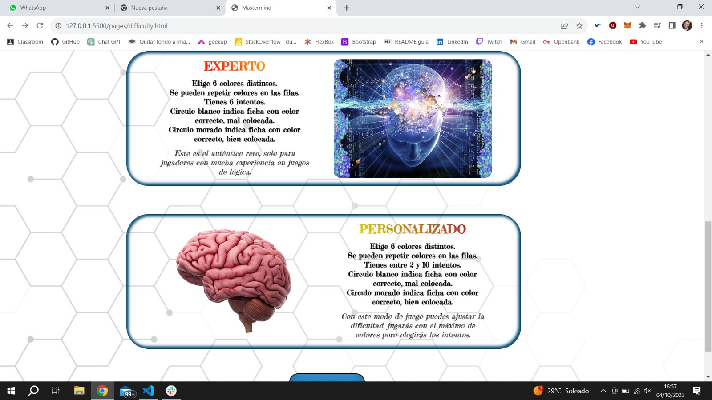
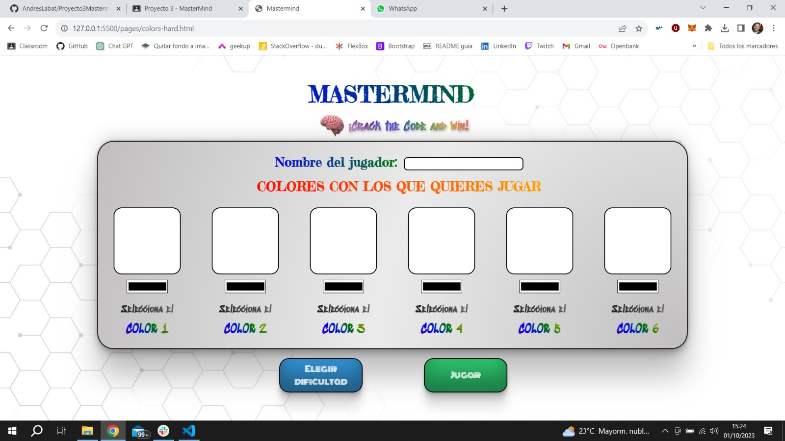

<h1 align="center"># README - 🕹️MasterMind🕹️</h1>

__
Proyecto 3 - Juego MasterMind - Semanas 3 y 4
__

__
Github pages: https://andreslabat.github.io/Proyecto3Mastermind/
__

Juego MasterMind, por Andrés Labat.
 
Desarrollado como parte del Bootcamp de Full Stack Developer de Geekshubs Academy.

_______________________________________________

**Juego MasterMind** es un proyecto que recrea una experiencia interactiva del juego de mesa MasterMind utilizando HTML, CSS, JavaScript, GIT y GitHub. Este proyecto incluye una serie de elementos interactivos que simulan el juego de mesa, así como algunas funciones útiles que te permiten acceder a las instrucciones o volver a elegir colores y dificultad con tan solo un click.

## 📋 Contenido del Proyecto

El proyecto **Juego MasterMind** consta de los siguientes archivos:

1. **🔌index.html🔌**: Página principal de bienvenida, sirve como acceso al menú del juego.

   

      
   
    
   

      <em><b>Bienvenida a MasterMind</b></em>
   
   

2. **🎮menu.html🎮**: Esta página tiene un vídeo de presentación divertido ambientado en cerebros, desde ella podrás acceder a las instrucciones de uso y al juego en sí.

   

      
   
    
   

      <em><b>Vídeo divertido y accesos a instrucciones y juego</b></em>
   
   

3. **📓instructions.html📓**: su contenido se centra en explicar las reglas y la finalidad del juego.

   

      
   
    
   

      <em><b>Instrucciones necesarias para jugar</b></em>
   
   

4. **🚪difficulty.html🚪**: en este menú podrás seleccionar la dificultad a la que quieras jugar basandote en tu experiencia previa.

   

      
   
    
   

      <em><b>Desde dificultad para jugadores nuevos</b></em>
   
   

   

      
   
    
   

      <em><b>Hasta expertos en juegos de lógica</b></em>
   
   

5. **🟪colors-easy.html, colors-medium.html, colors-hard.html🟪**: aquí seleccionaremos los colores con los que queremos jugar, la cantidad de colores a elegir dependerá de la dificultad seleccionada.

   

      
   
    
   

      <em><b>En principiante son 4 colores</b></em>
   
   

   

      
   
    
   

      <em><b>En experimentado son 5 colores</b></em>
   
   

   

      
   
    
   

      <em><b>En experto son 6 colores</b></em>
   
   

6. **🎲game-easy.html, game-medium.html, game-hard.html🎲**: la vista total de la página estará centrada en el tablero en el que se desarrolla la partida, teniendo funcionalidades extra en la parte derecha para poder navegar por los menús, consultar las instrucciones o rendirse.

   

      
   
    
   

      <em><b>En principiante tienes 10 oportunidades y 4 colores</b></em>
   
   

   

      
   
    
   

      <em><b>En experimentado tienes 8 oportunidades y 5 colores</b></em>
   
   

   

      
   
    
   

      <em><b>En experto tienes 6 oportunidades y 6 colores</b></em>
   
   

7. **🤑winner.html🤑**: esta pantalla solo la verás en el caso de que en cualquiera de las dificultades soluciones con éxito el tablero.

   

      
   
    
   

      <em><b>Se muestra la combinación ganadora, el nombre del jugador y una felicitación</b></em>
   
   

8. **😓losser.html😓**: a esta pantalla se puede acceder en cualquiera de las dificultades si te rindes o si se terminan los intentos y no has llegado a resolver el tablero.

   

      
   
    
   

      <em><b>Se muestra la combinación ganadora, el nombre del jugador y la posibilidad de jugar otra partida</b></em>
   
   

9. **🎨styles.css🎨**: Archivo CSS que proporciona estilos y diseño a todas las páginas.

10. **👀main.js👀**: es el archivo de JavaScript que recoge los valores del nombre del jugador y los colores seleccionados y los introduce en el local storage.

11. **💸winner-losser.js💸**: recoge los valores del nombre del jugador y de la combinación ganadora y los muestra por pantalla en winner.html y en losser.html.

12. **👾game-easy.js👾**: se encarga de toda la lógica necesaria para el correcto funcionamiento del juego en la dificultad principiante y guarda el resultado de la combinación ganadora en el local storage.

13. **👾game-medium.js👾**: se encarga de toda la lógica necesaria para el correcto funcionamiento del juego en la dificultad experimentadoy guarda el resultado de la combinación ganadora en el local storage.

14. **👾game-hard.js👾**: se encarga de toda la lógica necesaria para el correcto funcionamiento del juego en la dificultad expertoy guarda el resultado de la combinación ganadora en el local storage.

## 🔧 Tecnologías Utilizadas

- **HTML**: Utilizado para estructurar la página web y crear elementos interactivos.

- **CSS**: Aplicado para dar estilo y diseño a todos los htmls.

- **JavaScript**: Utilizado para controlar las interacciones y las funciones de cada elemento que lo requiera.

- **Git**: Sistema de control de versiones para el seguimiento de cambios en el proyecto.

- **GitHub**: Plataforma para alojar el repositorio en línea y colaborar en el desarrollo del proyecto.

## 🍃Ramas del Repositorio

Este proyecto se ha desarrollado en tres ramas. En la rama "dev" se han realizado las partes de maquetación y estilos en html y css, por otro lado en la rama "feature" se le han añadido las funcionalidades a los botones y se ha creado la lógica que permite jugar al MasterMind desde Javascript y, por último, todo este desarrollo en ambas ramas se ha unido a la rama principal "master", donde se ha creado este README.

## ⚙️Instrucciones de Uso

1. Clona este repositorio en tu máquina local usando el siguiente comando: `git clone [URL del repositorio]`.

2. Abre el archivo `index.html` en tu navegador web para comenzar a interactuar con el juego.

3. Explora todas las dificultades y diviértete jugando al clásico MasterMind.

## 🎮Explicación del Modo de Juego

Para aprender a jugar a **Juego Mastermind** debes conocer su funcionamiento:

El juego consiste en encontrar la combinación de fichas de colores escogida por el ordenador, haz click en los colores del lateral izquierdo para elegir que color quieres pintar y después click en las casillas grandes de la fila para pintarlo. 

   

      
   
    
   

      <em><b>Pincha en el color que quieras y después haz click en la casilla que te gustaría pintar</b></em>
   
   

La idea es encontrar la combinación de fichas de colores oculta. Comenzando por la parte superior, cada fila de huecos determina un turno de la partida. En cada turno debemos pintar las casillas de colores en todos los huecos de su fila y hacer click en "check", esto nos permitirá descubrir los aciertos en los puntos de la parte derecha, o incluso, si hemos acertado todos, terminar el juego.

   

      
   
    
   

      <em><b>Al pulsar al boton check, te dejará pintar en la siguiente línea y podras descubrir tus aciertos y fallos</b></em>
   
   

En los puntos de la parte derecha podrás descubrir tus aciertos y fallos:
- **Sin cambio**: Si no cambian de color, es que el color no existe en la combinación ganadora.
- **Color blanco**: Si cambia a blanco, es que el color está, pero no en esa posición.
- **Color morado**: Si cambia a morado, es que la posición y el color son correctos.

   

      
   
    
   

      <em><b>Son los encargados de darte las pistas para acertar la combinación ganadora</b></em>
   
   

     
Sigue las pistas de cada jugada para planear la combinación de colores del siguiente turno, si acertamos la combinación, los cuatro puntos aparecerán de color morado y se mostrará la combinación oculta. 

La barra de botones de la parte lateral derecha te permitirá realizar las siguientes acciones:
        
- **Reiniciar la partida**: Elimina el progreso de la partida actual y la comienza de nuevo. La combinación de colores será la misma que habías seleccionado.
- **Seleccionar colores**: Permite volver a seleccionar los colores de la partida pero la partida se reiniciará.
- **Seleccionar dificultad**: Permite seleccionar las características de la partida y definir un tablero personalizado.
- **Volver al menú de inicio**: Nos llevará al vídeo de presentación donde podremos volver a comenzar.
- **Instrucciones del juego**: Acceso a las instrucciones del juego que estas leyendo.
- **Rendirse**: La partida terminará automáticamente y te mostrará la combinación ganadora en la misma pantalla que si no aciertas antes de acabar los intentos.

   

      
   
    
   

      <em><b>Este menú lateral te permitirá realizar acciones más allá del propio juego</b></em>
   
   

## 🎯Problemas y Soluciones

### 1. El tamaño de la consola y el Dock son muy grandes

- **🚧Problema**: Debido a que el diseño original se ha realizado en el monitor de 32 pulgadas de mi ordenador de sobremesa, al abrir el proyecto en el ordenador portatil, que tiene una resolución distinta, quedaban enormes todos los elementos de la consola.

   - **💡Solución**: Escalar todos los elementos del Css menos el del vídeo que hay de fondo al 70% de su tamaño y redistribuirlos en altura y anchura por la pantalla.

   

      
   
    
   

      <em><b>Este es el aspecto de los elementos después del escalado, visto en el monitor de 32 pulgadas</b></em>
   
   

   

      
   
    
   

      <em><b>Este es el aspecto de los elementos en el ordenador portatil</b></em>
   
   

### 2. Doble click en algunas posiciones para que los eventos ocurran

- **🚧Problema**: El mayor problema que he tenido a la hora de realizar los carruseles es hacer la parte de Css de forma que quede bien definido lo que quiero que ocurra en cada posición, ya que a veces necesitaba 2 clicks en un mismo botón para que ocurriera el cambio de imagen.

   - **💡Solución**: El uso de una variable definida anteriormente fuera del evento para poder usarla como condición en los "if" e "if else".

   

      
   
    
   

      <em><b>La variable "posición" es la encargada del correcto funcionamiento de los carrusel</b></em>
   
   

### 3. Evitar que el evento del Joy-con ocurriera al hacer click en un botón contenido dentro del mismo

- **🚧Problema**: En un principio diseñe que cuando se hiciera click en un mando, en cualquiera de sus puntos, este se desplazara hasta la parte superior de la consola y, en caso de estar ya en la posición superior, volviera al lateral de la consola, pero esto hacía que al hacer click en alguno de sus botones, en lugar de suceder el evento del botón en concreto, sucediera el evento del mando .

   - **💡Solución**: Agregarle a los botones en el código de javascript un event.stopPropagation(); de esta forma, solo su evento particular sucedía al hacerle click en dicho botón.

   

      
   
    
   

      <em><b>Hacer click en cualquier punto del mando provocaba su desplazamiento y anulaba el resto de eventos de sus botones</b></em>
   
   

### 4. Evitar que un evento ocurriera al hacer click por accidente en el Joy-con

- **🚧Problema**: El hecho de haber diseñado que cuando se hiciera click en un mando, en cualquiera de sus puntos esto provocara su desplazamiento hacía que al hacer click en alguno de sus botones, si por accidente pinchabas fuera, ocurriera el evento del mando, siendo incómodo ya que implicaba un desplazamiento del mismo.

   - **💡Solución 1**: Eliminar el evento de desplazamiento del mando en cualquier punto del mismo, y asignarselo a su propio jostick, quedando mucho mas controlado y elegante en la ejecución, ya que además le he añadido movimiento al jostick al clickar sobre él.

   

      
   
    
   

      <em><b>Ahora para provocar el desplazamiento del mando, hay que hacer click en el jostick</b></em>
   
   

## 🤝 Cómo Contribuir

Si deseas contribuir a este proyecto, puedes realizar un fork del repositorio en GitHub, hacer tus cambios y enviar una solicitud de extracción (pull request). Tu contribución será revisada y, si es apropiada, se fusionará con la rama principal.

1. Haz un fork de este repositorio.

2. Crea una nueva rama para tu contribución: `git checkout -b tu-nueva-caracteristica`.

3. Realiza tus cambios y commitea: `git commit -m "Añade una nueva característica"`.

4. Envía tus cambios al repositorio: `git push origin tu-nueva-caracteristica`.

5. Crea una solicitud de extracción en GitHub.

Espero que disfrutes explorando y utilizando el juego MasterMind. Si tienes alguna pregunta o necesitas asistencia, no dudes en ponerte en contacto conmigo a través de la información de contacto proporcionada.

## 📝Autor

- **Nombre**: Andrés Labat Beltrán
- **Fecha de Comienzo del Proyecto**: 28/09/2023
- **Email**: andreslabat89@gmail.com.
- **Linkedin**: www.linkedin.com/in/andres-labat-beltran-99a082292.

## ⚖️ Licencia

Este proyecto está bajo la Licencia MIT. Consulta el archivo `LICENSE` para obtener más información.

## 👏Agradecimientos

Agradecimentos a GeeksHubs Academy por los conocimientos que he podido adquirir estas tres semanas y que han hecho posible este proyecto, y a nuestros queridos profesores David Ochando y Dani Tarazona y su gran paciencia con nosotros.

Quiero hacer una mención especial a mi mujer, Alba, ya que sin su apoyo e inspiracion ni este ni ningún otro proyecto llegarían a ser una realidad.

¡Gracias por visitar **Juego MasterMind** y explorar mi proyecto!

